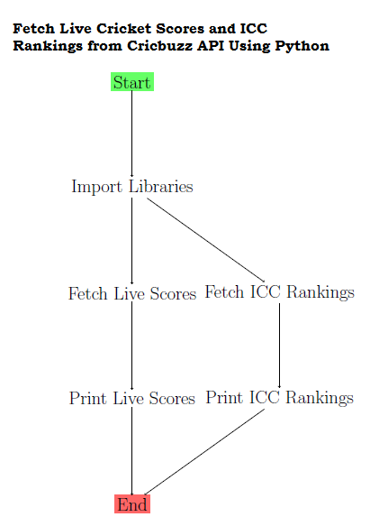
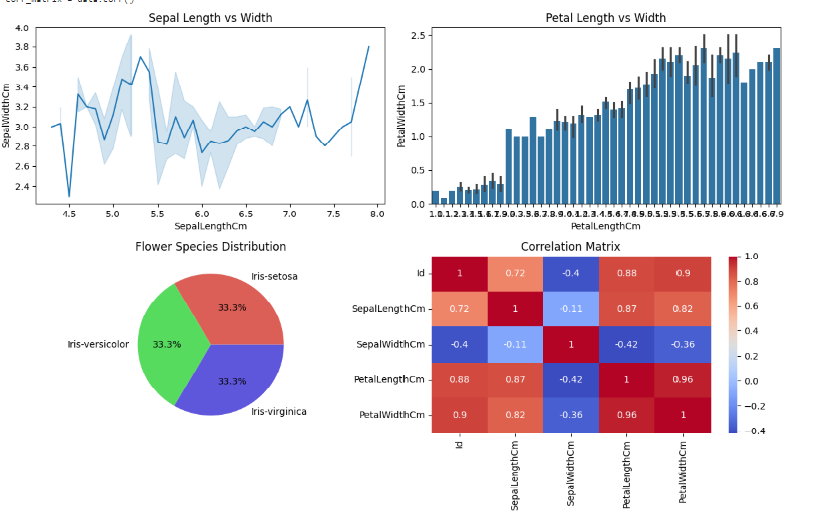

# My Python Projects Portfolio

This is a portfolio of my projects made in python.

# About Me

I am a software engineer with 2+ years of hand-on experience in building and deploying python applications. I am passionate about creating user-friendly and efficient software.

# Skills

* Programming Languages : Python
* Data Analysis : Data cleaning and visualization using Pandas and Matplotlib.
* Machine Learning : Model training and evaluation using Python libraries such as sklearn and joblib.
* Communication : Authored a book chapter in the Springer book ”Homomorphic Encryption for Financial Cryptography”.
* Teamwork : Led a team of three persons in implementing a new Login Interface Algorithm.I was also the lead developer.

# Projects

## Project 1:Stock Price Prediction and Trading Strategy using Machine Learning with Python

This project utilizes machine learning techniques in Python to predict stock prices and implement a basic trading strategy.Achieved an average profit of 1.95 per trade over six months and accurately predicting buy and sell signals for the subsequent 93 days, demonstrating the effectiveness of the implemented trading strategy.

## Chart Preview:

## Final Result :

The final result of the Stock Price Prediction and Trading Strategy using Machine Learning with Python has been displayed below ,

## Technical Report

The project has been published as an technical report in **Open Science Framework**, to which the link is provided below.  
        
                        https://osf.io/zj4b3/?view_only=cb6705ac505e4f769e82b25ec0bf5b6c

* [Link to Project 1](https://github.com/VasudevanS1906/ml_stock_prediction_trading_strategy)

## Project 2:  BAGIT Catalog Digitization

Developed a catalog digitization solution using Python 2.7 that supports multiple input formats including text, voice, image, text in Indic languages, voice in Indic languages, and combinations of all three using gtts and pytesseract libraries.Achieved a throughput of 32400 items per hour in Text mode.

## Workflow Diagram

The workflow diagram for the project is picturized as follows,

## The Test Cases & Final Results

**The eight test cases** required for the catalog digitisation are as follows : 

Text mode digitization
Text indic mode digitization
Voice mode digitization
Voice indic mode digitization
Image mode digitization
Combination of all three(Image,text & voice) mode digitisation
View digitized catalogs
Mechanism to measure the throughput of digitisation 

The first 6 test cases can be evaluated by the Program gathering data from user and saving it
successfully in the database. Test case no.7 is assessed using hoow it can retrieve data from
Database and show it to the user . 
Test case no.8 is evaluated using how it can measure the
**throughput of digitization by figuring out the total time taken for digitizing the total number of products.**   

The results of the  eight test cases has been attached below in the form of a collage,

* [Link to Project 2](https://github.com/VasudevanS1906/Catalog-Digitization)

## Project 3: Fetch Live Cricket Scores and ICC Rankings from Cricket API Using Python

This Python script utilizes the Cricket API to fetch live cricket scores, match updates, and ICC rankings. It provides a comprehensive solution for cricket enthusiasts seeking real-time information about ongoing matches and top 15 player standings.

## Final Results

## For ICC Rankings feature,

## For News feature,

To view the complete image ,see the file **api5.png**

## Workflow Diagram 

The workflow diagram displayed below demonstrates how to Fetch Live Cricket Scores and ICC Rankings from Cricket API Using Python.

* [Link to Project 3](https://github.com/VasudevanS1906/cricket_news_ranks_api_integration)

## Project 4 : Data Analysis Dashboard

This project analyzed the Iris dataset which is a classic dataset used in machine learning and statistics. It consists of 150 samples of three different species of Iris flowers: Setosa, Versicolor, and Virginica. Each sample has four features: sepal length, sepal width, petal length, and petal width. Here, we have demonstrated the development of a data analysis dashboard using Python libraries such as Pandas, NumPy, Matplotlib, and Seaborn. The dashboard provides various visualizations to analyze and understand the data effectively.

## Dashboard Final Output 

The final output of the python dashboard using pandas,numpy,matplotlib and seaborn has been displayed below ,

* [Link to Project 4](https://github.com/VasudevanS1906/data-visualization-dashboard)

## Project 5 : Obtaining live cricket scores from Cricbuzz using webscraping 

This project aims to scrape data from the Cricbuzz website, specifically match details, team details, score, result, and commentary for live matches. It also selects a particular team to view the results indiviually and removes a particular team from the result. The extracted data is then printed to the console.

## Final Result

The script will print the extracted data for each live match to the console. The output will be similar to the following:

For Filter match option 

For Select match option

## Workflow Diagram 

The workflow diagram displayed below demonstrates how to use webscraping to obtain live cricket scores from Cricbuzz.

* [Link to Project 5](https://github.com/VasudevanS1906/cricket_score_webscrape)

# Publications

## Improved Login Interface Algorithm for Financial Transactions Using Visual Cryptographic Authentication

Spearheaded the creation of a novel login interface for a book chapter in the Springer International Publishing book *”Homomorphic Encryption for Financial Cryptography”*, enabling users to upload images as passwords using Python, thereby increasing security and usability.

* [Link to Publication](https://www.springerprofessional.de/en/improved-login-interface-algorithm-for-financial-transactions-us/25870548)

# Contact

If you have any questions, please feel free to contact me at [vasudevanswornampillai@gmail.com].
